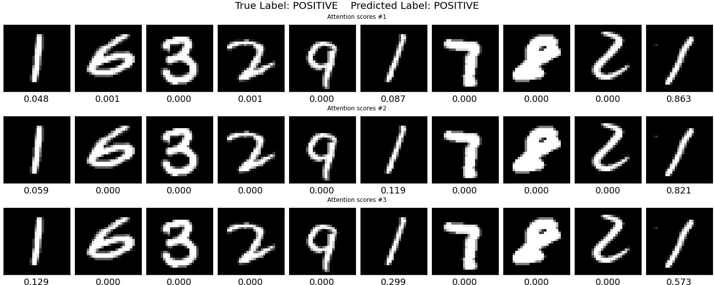
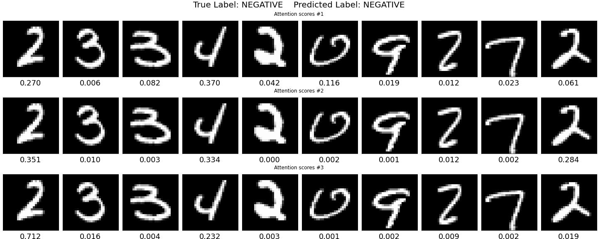

# Multi-Scale Attention-based Multiple Instance Learning for Classification of Multi-Gigapixel Histology Images

Model implementation of paper [[arXiv]](https://arxiv.org/abs/2209.03041) by Made Satria Wibawa, Kwok-Wai Lo, Lawrence Young, Nasir Rajpoot

This is a supplementary code and notebook for training and testing the model in MNIST dataset from **Multi-Scale Attention-based Multiple Instance Learning for Classification of Multi-Gigapixel Histology Images** paper.

Presented in AI-enabled Medical Image Analysis (AIMIA) workshop at ECCV 2022.


```
Attention score for true positive prediction.
Number below the digit images is the attention score, each row represent n-th attention layer.
```

<p align="center">
  
</p>

```
Attention score for true negative prediction.
Number below the digit images is the attention score, each row represent n-th attention layer.
```
<p align="center">
  
</p>